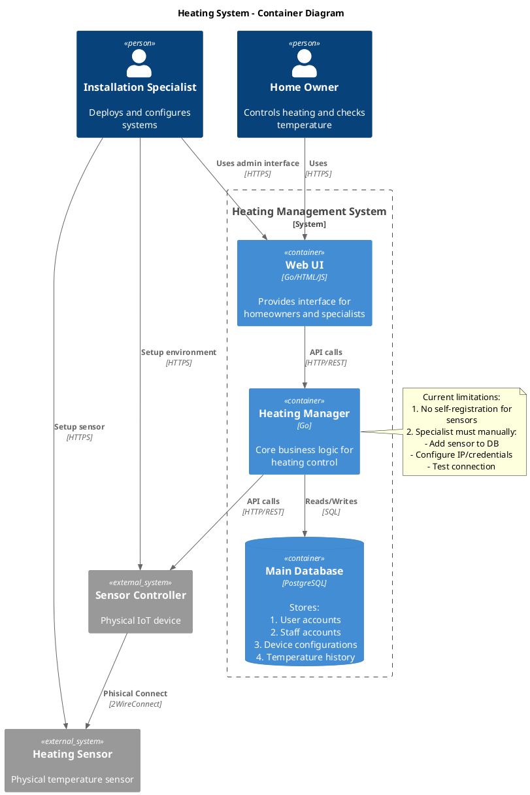

```puml
@startuml Heating System - Container Diagram
!include <C4/C4_Container>
' !include https://raw.githubusercontent.com/plantuml-stdlib/C4-PlantUML/master/C4_Container.puml

title Heating System - Container Diagram

Person(owner, "Home Owner", "Controls heating and checks temperature")
Person(specialist, "Installation Specialist", "Deploys and configures systems")

System_Boundary(heating_system, "Heating Management System") {
    Container(web_ui, "Web UI", "Go/HTML/JS", "Provides interface for homeowners and specialists")
    Container(heating_manager, "Heating Manager", "Go", "Core business logic for heating control")
    ContainerDb(main_db, "Main Database", "PostgreSQL", "Stores:\n 1. User accounts\n 2. Staff accounts\n 3. Device configurations\n 4. Temperature history")    
}
System_Ext(sensor_controller, "Sensor Controller", "Physical IoT device")
System_Ext(sensor, "Heating Sensor", "Physical temperature sensor")

' Relationships
Rel(owner, web_ui, "Uses", "HTTPS")
Rel(specialist, web_ui, "Uses admin interface", "HTTPS")
Rel(specialist, sensor_controller, "Setup environment", "HTTPS")
Rel(specialist, sensor, "Setup sensor", "HTTPS")

Rel(web_ui, heating_manager, "API calls", "HTTP/REST")

Rel(heating_manager, main_db, "Reads/Writes", "SQL")
Rel(heating_manager, sensor_controller, "API calls", "HTTP/REST")
Rel(sensor_controller, sensor, "Phisical Connect", "2WireConnect")

' Deployment note
note right of heating_manager
    Current limitations:
    1. No self-registration for sensors
    2. Specialist must manually:
    - Add sensor to DB
    - Configure IP/credentials
    - Test connection
end note

@enduml
```