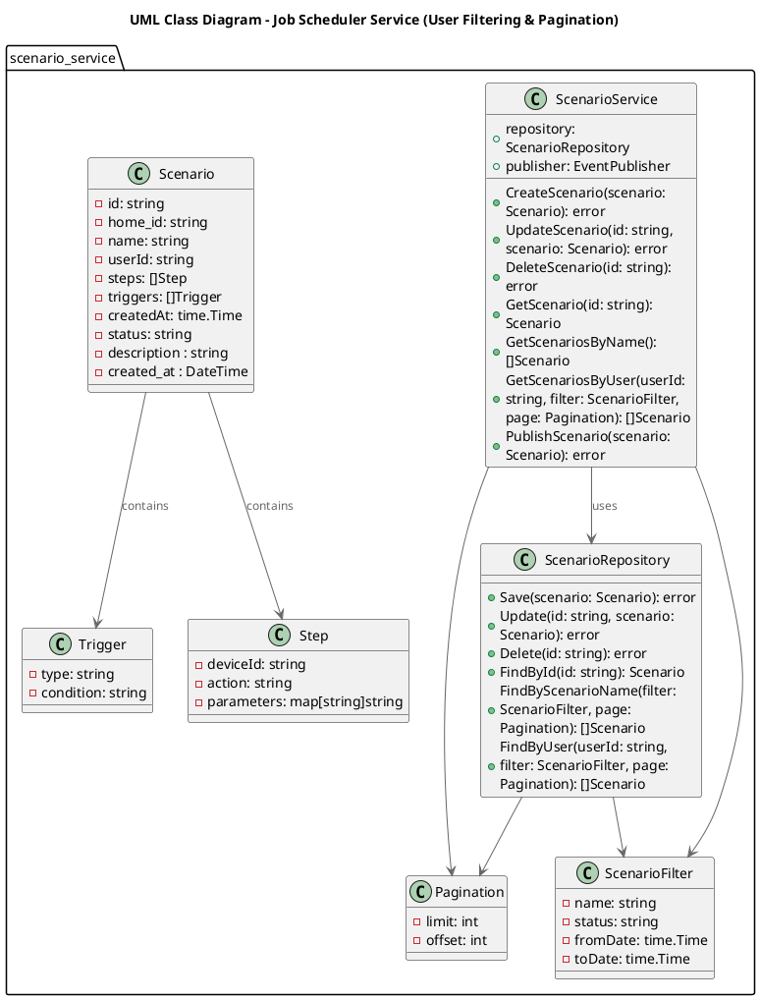

```puml
@startuml
!include <C4/C4_Component>
title UML Class Diagram - Job Scheduler Service (User Filtering & Pagination)
top to bottom direction


package "scenario_service" {

    class ScenarioService {
        + repository: ScenarioRepository
        + publisher: EventPublisher

        + CreateScenario(scenario: Scenario): error
        + UpdateScenario(id: string, scenario: Scenario): error
        + DeleteScenario(id: string): error
        + GetScenario(id: string): Scenario
        + GetScenariosByName(): []Scenario
        + GetScenariosByUser(userId: string, filter: ScenarioFilter, page: Pagination): []Scenario
        + PublishScenario(scenario: Scenario): error
    }

    class ScenarioRepository {
        + Save(scenario: Scenario): error
        + Update(id: string, scenario: Scenario): error
        + Delete(id: string): error
        + FindById(id: string): Scenario
        + FindByScenarioName(filter: ScenarioFilter, page: Pagination): []Scenario
        + FindByUser(userId: string, filter: ScenarioFilter, page: Pagination): []Scenario
    }

    class Scenario {
        - id: string
        - home_id: string
        - name: string
        - userId: string
        - steps: []Step
        - triggers: []Trigger
        - createdAt: time.Time
        - status: string
        - description : string
        - created_at : DateTime
    }
    

    class Step {
        - deviceId: string
        - action: string
        - parameters: map[string]string
    }

    class Trigger {
        - type: string
        - condition: string
    }

    class ScenarioFilter {
        - name: string
        - status: string
        - fromDate: time.Time
        - toDate: time.Time
    }

    class Pagination {
        - limit: int
        - offset: int
    }

    ' Relationships
    ScenarioService --> ScenarioRepository : uses
    Scenario --> Step : contains
    Scenario --> Trigger : contains
    ScenarioService --> ScenarioFilter
    ScenarioService --> Pagination
    ScenarioRepository --> ScenarioFilter
    ScenarioRepository --> Pagination
}

@enduml
```