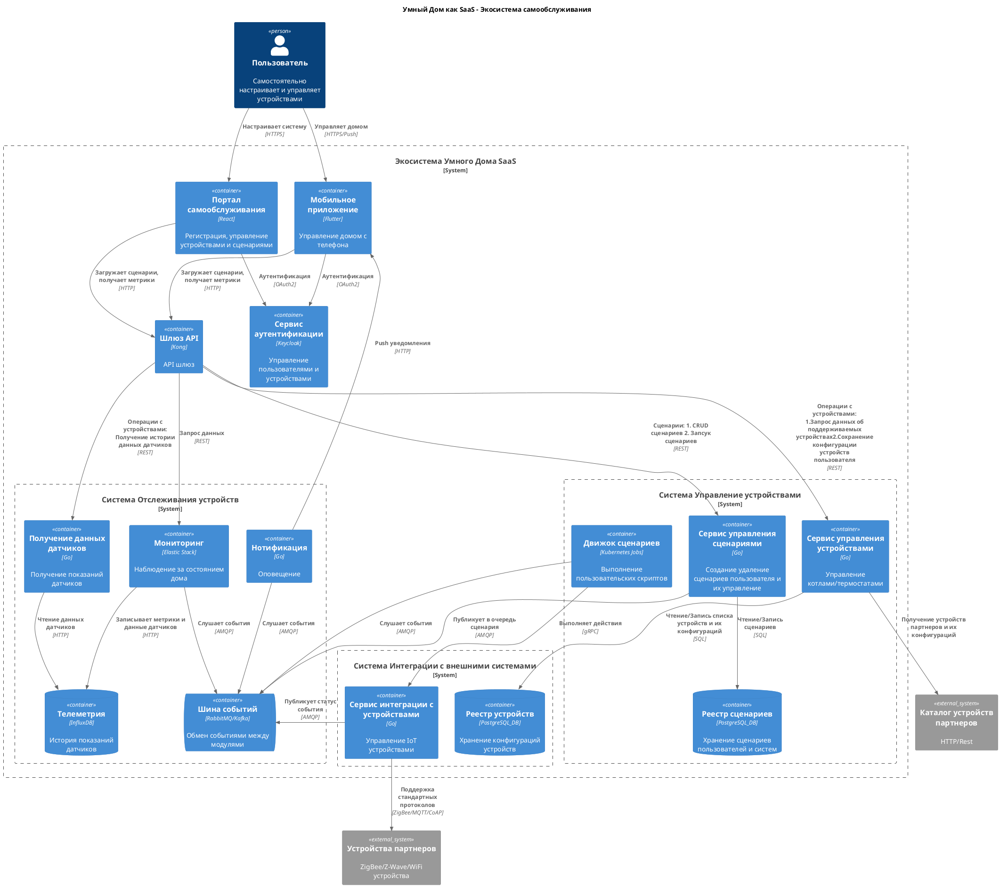

```puml
@startuml
!include <C4/C4_Container>

title Умный Дом как SaaS - Экосистема самообслуживания

Person(user, "Пользователь", "Самостоятельно настраивает и управляет устройствами")

System_Boundary(saas_ecosystem, "Экосистема Умного Дома SaaS") {

    Container(web_portal, "Портал самообслуживания", "React", "Регистрация, управление устройствами и сценариями")
    Container(mobile_app, "Мобильное приложение", "Flutter", "Управление домом с телефона")
    Container(auth_service, "Сервис аутентификации", "Keycloak", "Управление пользователями и устройствами")
    Container(api_gateway, "Шлюз API", "Kong", "API шлюз")
    System_Boundary(device_mgmt, "Система Управление устройствами") {

        Container(device_manager, "Сервис управления устройствами", "Go", "Управление котлами/термостатами")
        Container(job_scheduler, "Сервис управления сценариями", "Go", "Создание удаление сценариев пользователя и их управление")
        Container(scenario_engine, "Движок сценариев", "Kubernetes Jobs", "Выполнение пользовательских скриптов")
        ContainerDb(scenario_db, "Реестр сценариев", "PostgreSQL_DB", "Хранение сценариев пользователей и систем")
    }
    System_Boundary(integration, "Система Интеграции с внешними системами") {
        Container(device_collector, "Сервис интеграции с устройствами", "Go", "Управление IoT устройствами")
        ContainerDb(device_db, "Реестр устройств", "PostgreSQL_DB", "Хранение конфигураций устройств")
    }
    System_Boundary(device_tracking, "Система Отслеживания устройств") {
        Container(monitoring, "Мониторинг", "Elastic Stack", "Наблюдение за состоянием дома")
        Container(notify, "Нотификация", "Go", "Оповещение")
        Container(telemetry_data, "Получение данных датчиков", "Go", "Получение показаний датчиков")
        ContainerDb(telemetry_db, "Телеметрия", "InfluxDB", "История показаний датчиков")
        ContainerQueue(event_bus, "Шина событий", "RabbitMQ/Kafka", "Обмен событиями между модулями")
    }
}

System_Ext(partner_devices, "Устройства партнеров", "ZigBee/Z-Wave/WiFi устройства")
System_Ext(partners_catalogs, "Каталог устройств партнеров", "HTTP/Rest")

' Основные взаимодействия пользователя
Rel(user, web_portal, "Настраивает систему", "HTTPS")
Rel(user, mobile_app, "Управляет домом", "HTTPS/Push")

' Взаимодействия порталов
Rel(web_portal, auth_service, "Аутентификация", "OAuth2")
Rel(mobile_app, auth_service, "Аутентификация", "OAuth2")
Rel(web_portal, api_gateway, "Загружает сценарии, получает метрики", "HTTP")
Rel(mobile_app, api_gateway, "Загружает сценарии, получает метрики", "HTTP")
Rel(notify, mobile_app, "Push уведомления", "HTTP")


' Управление устройствами
Rel(api_gateway, monitoring, "Запрос данных", "REST")
Rel(api_gateway, device_manager, "Операции с устройствами: 1.Запрос данных об поддерживаемых устройствах2.Сохранение конфигурации устройств пользователя", "REST")
Rel(api_gateway, job_scheduler, "Сценарии: 1. CRUD сценариев 2. Запсук сценариев", "REST")
Rel(job_scheduler, event_bus, "Публикует в очередь сценария", "AMQP")
Rel(api_gateway, telemetry_data, "Операции с устройствами: Получение истории данных датчиков", "REST")

' Интеграция с устройствами
Rel(device_collector, partner_devices, "Поддержка стандартных протоколов", "ZigBee/MQTT/CoAP")
Rel(device_manager, partners_catalogs, "Получение устройств партнеров и их конфигураций")

' Работа с данными
Rel(monitoring, telemetry_db, "Записывает метрики и данные датчиков", "HTTP")
Rel(device_manager, device_db, "Чтение/Запись списка устройств и их конфигураций", "SQL")
Rel(job_scheduler, scenario_db, "Чтение/Запись сценариев", "SQL")
Rel(telemetry_data, telemetry_db, "Чтение данных датчиков", "HTTP")

' Сценарии и автоматизация
Rel(scenario_engine, event_bus, "Слушает события", "AMQP")
Rel(scenario_engine, device_collector, "Выполняет действия", "gRPC")
Rel(device_collector, event_bus, "Публикует статус события", "AMQP")
Rel(monitoring, event_bus, "Слушает события", "AMQP")
Rel(notify, event_bus, "Слушает события", "AMQP")

@enduml
```